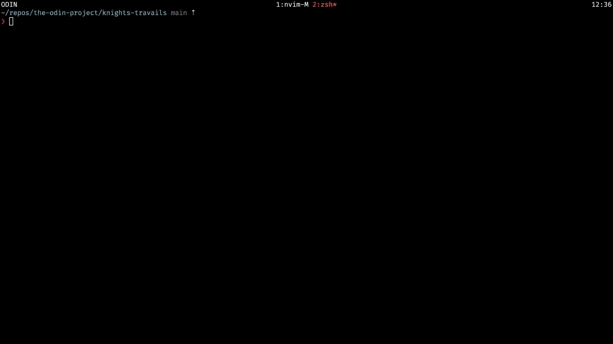

# Knight's Travails

This program finds the shortest path a knight can take to move from a starting square to a target square on an 8x8 chessboard.



## Feature
- Uses breadth-first search algorithm to explores each next move possibility level by level.
- Renders the path sequence visually on a console.

## Installation & Usage

Clone repository
```
git clone https://github.com/SakolkiatNr/knights-travails.git

cd knights-travails
```

Usage 
x,y value is between 0 - 7
```
node knightTravails "[x1,y1]" "[x2,y2]"
```

Example 
```
node knightsTravails.js "[0,0]" "[0,7]"
```
## Acknowledgement
- The knight travails problem from [The Odin Project](https://www.theodinproject.com/lessons/javascript-knights-travails).
